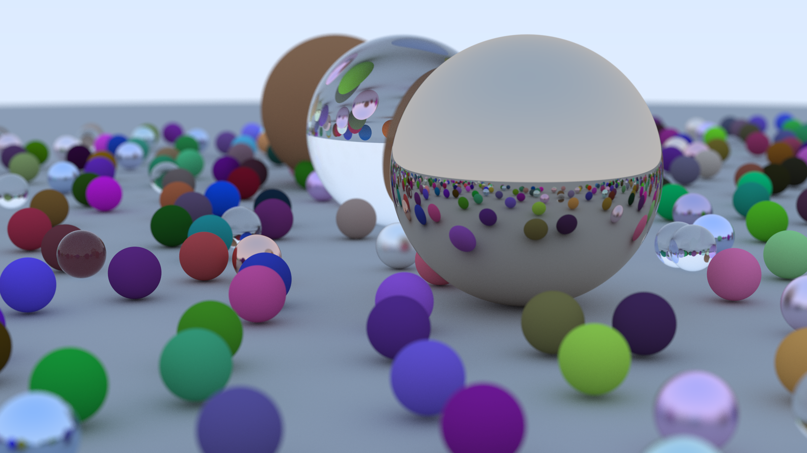

# Ray Tracing in One Weekend

Implementation of [Ray Tracing in One Weekend](https://raytracing.github.io/books/RayTracingInOneWeekend.html) by Peter Shirley using in Rust using parallelism.

```shell
cargo run > image.ppm
```

## 4K Render Sample


## 1080P Render Sample


